# CRA-RBM Assistant

CRA-RBM Assistant is a prototype web application designed to support Clinical Research Associate (CRA) monitoring preparation by structuring public clinical trial information and synthetic site monitoring data.

It focuses on translating CRA monitoring concepts into structured data workflows, review dashboards, issue tracking, and report draft generation.

This project connects backend development, data quality management, and clinical research operations by implementing core workflows related to protocol review, site monitoring preparation, query/deviation follow-up, and risk-based monitoring.

## 1. Project Background

Clinical Research Associates are responsible for supporting clinical trial quality by monitoring protocol compliance, subject safety, data integrity, essential document readiness, investigational product accountability, and site performance.

As clinical trials become more data-driven and risk-based, CRAs are increasingly expected to understand not only documents and regulations, but also data flow, system usage, query management, and risk indicators across trial sites.

This project was developed as a portfolio project to demonstrate how software engineering and data management experience can be applied to CRA-related workflows.

## Career Transition Context

This project was created as a career-transition portfolio project for moving from data management and software development experience into a Clinical Research Associate role.

The project is designed to show how data quality management, issue tracking, API development, database design, and dashboard implementation can be applied to CRA monitoring workflows.

Core strengths demonstrated by this project include:

- Structuring operational data into reviewable workflows
- Tracking missing, pending, expired, and unresolved items
- Connecting risk indicators to CRA follow-up actions
- Translating site-level data into monitoring report draft content
- Applying audit-like traceability to data changes
- Understanding the relationship between clinical trial operations, data quality, and monitoring preparation

## 2. Project Goal

The goal of this project is to build a CRA-oriented monitoring support prototype that can:

- Import or define clinical study information
- Extract key protocol-related elements
- Generate SIV and IMV checklist items
- Manage synthetic site monitoring data
- Calculate site-level risk scores
- Suggest CRA follow-up action items for high-risk sites

This application does not use real patient data or confidential clinical trial documents. All site-level data is synthetic and created only for portfolio and educational purposes.

## 3. Main Features

### Study Overview

Displays structured study information such as:

- Study title
- Phase
- Indication
- Study design
- Intervention
- Comparator
- Primary endpoint
- Secondary endpoint
- Inclusion criteria
- Exclusion criteria

### CRA Checklist Generator

Generates CRA-oriented checklist items for:

- Site Initiation Visit, SIV
- Interim Monitoring Visit, IMV
- Essential document review
- Informed consent review
- Eligibility review
- Safety reporting process
- Investigational product accountability
- Source data and eCRF consistency

### Site Risk Dashboard

Visualizes site-level monitoring data and calculated risk scores using synthetic monitoring data:

- Enrollment progress (display only)
- Open query count
- Query aging
- Protocol deviation count
- SAE reporting delay
- Missing essential documents
- IP accountability and ICF issues (via risk factors)
- Risk score
- Risk level

### CRA Follow-up Action Items

Suggests follow-up actions based on detected site risks, such as:

- Query resolution follow-up
- Protocol deviation root cause review
- SAE reporting process retraining
- Essential document reconciliation
- Site staff retraining consideration

### ClinicalTrials.gov Study Import

Supports public clinical trial registry search and study preview using ClinicalTrials.gov API.

Current features include:

- Search public clinical studies by keyword
- Preview NCT ID, title, phase, condition, intervention, study design, outcomes, and eligibility criteria
- Import selected public study into Supabase PostgreSQL
- Automatically generate synthetic demo sites and monitoring metrics for imported studies
- Display imported studies in the existing Study Overview and Risk Dashboard workflow
- Distinguish import status as created or updated

### Trigger-based Audit-like Logs

Implements a PostgreSQL trigger-based change log to demonstrate data change traceability.

Tracked changes include:

- Study insert/update/delete
- Site insert/update/delete
- Monitoring metric insert/update/delete
- Old data and new data comparison using JSONB

This feature is intended to demonstrate traceability concepts and is not a validated regulatory audit trail.

### Site Review Hub

Provides an integrated site-level review page that brings together site risk, document readiness, protocol deviation status, ICF version issues, and monitoring report draft access.

The Site Review Hub helps demonstrate how CRA monitoring preparation can be organized around each trial site rather than separate disconnected pages.

### Enhanced Monitoring Report Draft

Generates an IMV-style monitoring report draft by integrating:

- Site risk summary
- Essential document readiness findings
- Protocol deviation findings
- ICF version control findings
- CRA follow-up action plan

This feature demonstrates how structured monitoring data can support CRA documentation preparation.

### Essential Document Readiness Tracker

Tracks site-level essential document status using synthetic document records.

Current document statuses include:

- Ready
- Missing
- Pending
- Expired

The tracker calculates a readiness score and summarizes document-related follow-up needs.

### Protocol Deviation Tracker

Tracks protocol deviation records by:

- Category
- Severity
- Status
- Subject code
- Root cause
- Corrective action
- Preventive action

This feature demonstrates issue categorization and follow-up tracking beyond simple deviation counts.

### ICF Version Control Check

Checks whether subject consent records are consistent with the ICF version that was effective on the consent date.

This feature demonstrates date-based version consistency validation, which connects data quality logic with CRA informed consent review.

### Authentication and Import Protection

Supabase Auth is used to protect write operations.

Public users can review dashboards and CRA workflow pages without signing in, while ClinicalTrials.gov study import requires authentication because it creates or updates Supabase records.

## 4. System Architecture

### Current Architecture

```
Next.js Frontend
        ↓
FastAPI Backend (feature routers under backend/app/api/)
        ↓
Supabase PostgreSQL
        ↓
CRA Review Services
```

Backend services include:

- Risk Scoring Service
- Action Item Service
- Site Review Summary Service
- Monitoring Report Draft Service
- Essential Document Readiness Service
- Protocol Deviation Service
- ICF Version Check Service

→ CRA Dashboard / Site Review Hub

### External Study Import Flow

```
ClinicalTrials.gov API
        ↓
FastAPI External Study Import API
        ↓
Supabase PostgreSQL
        ↓
Synthetic Operational Demo Data Generation
```

Generated demo data includes:

- Demo sites
- Monitoring metrics
- Essential documents
- Protocol deviations
- ICF versions and subject consents

→ Site Review Hub / Risk Dashboard / Monitoring Report Draft

### Authentication Scope

```
Unauthenticated users
  → Read-only access to dashboards, site review pages, and audit logs

Authenticated users (Supabase Auth)
  → ClinicalTrials.gov study import (Supabase writes)
```

### Planned Automation Architecture

```
n8n Scheduled Workflow
        ↓
FastAPI High-risk Site Alert API
        ↓
Slack / Discord / Email Notification
```

## 5. Data Sources

This project separates public study-level data from synthetic site-level operational data.

Public data:

- ClinicalTrials.gov public registry data
- NCT ID, title, phase, condition, intervention, outcomes, and eligibility criteria

Synthetic demo data:

- Site information
- Monitoring metrics
- Essential document status
- Protocol deviation records
- ICF versions and subject consent records
- CRA follow-up action items
- Monitoring report draft inputs

No real subject data, real patient data, real site performance data, confidential sponsor protocol, or proprietary clinical trial document is used.

## 6. MVP Scope

The current MVP demonstrates a CRA-oriented site review workflow using public study-level data and synthetic site-level operational data.

The MVP includes:

- ClinicalTrials.gov public study search and detail preview
- Auth-gated public study import into Supabase
- Automatic synthetic operational data generation for imported studies
- Study overview and site risk dashboard
- Site Review Hub for integrated site-level review
- CRA follow-up action item recommendations
- Enhanced monitoring report draft generation
- Essential document readiness tracking
- Protocol deviation tracking
- ICF version control check
- Trigger-based audit-like data change logs

## 7. Risk Scoring Logic

Site risk is calculated based on the following indicators:

- Open query count
- Query aging days
- Protocol deviation count
- SAE reporting delay count
- Missing essential document count
- IP accountability issue count
- ICF issue count

`targetEnrollment` and `currentEnrollment` are displayed for site context on dashboards but are not used in the risk score calculation.

Risk level:

- 0 to 2 points : Low
- 3 to 5 points : Medium
- 6 points or higher : High

Detailed logic is described in docs/risk-scoring-logic.md

## 8. Tech Stack

Current stack:

- Frontend: Next.js
- Backend: FastAPI
- Database: Supabase PostgreSQL
- Authentication: Supabase Auth
- External API: ClinicalTrials.gov API
- Audit-like logging: PostgreSQL trigger-based change logs
- Future automation: n8n
- Future deployment: Vercel, Render/Railway/Fly.io, or AWS
- Future AI integration: LLM-based protocol summarization and checklist generation

FastAPI is selected for rapid API development, clinical trial registry API integration, risk scoring logic, and future LLM-based document processing.

Supabase PostgreSQL is selected to provide a managed relational database for study, site, checklist, and monitoring metric data while supporting fast MVP development and deployment.

## 9. Auth

### Authentication and Import Protection

Public users can browse study dashboards, site review pages, monitoring report drafts, audit logs, and CRA review modules without signing in.

ClinicalTrials.gov study import is protected by Supabase Auth because it creates or updates records in Supabase PostgreSQL, including synthetic demo operational data.

This design keeps the portfolio demo accessible while preventing uncontrolled database writes in a deployed environment.

Current authentication scope:

- Public read access for dashboard review
- Authenticated import access
- No user-level row ownership in the current MVP
- Full multi-tenant RLS-based access control is planned for a future production-oriented version

## 10. Project Limitations

This project is a prototype and has the following limitations.

- It does not replace CRA judgement.
- It does not provide regulatory or medical advice.
- It does not use real clinical trial subject data.
- Risk scoring logic is simplified for demonstration.
- Checklist generation is based on predefined rules and templates in the MVP version.
- This project includes a simplified trigger-based audit-like log for data change traceability, but it is not a validated audit trail.
- This project does not implement validated clinical trial system requirements such as electronic signature, system validation, or 21 CFR Part 11 compliance.
- Supabase Auth is used to protect study import, but user-level row ownership and RLS-based multi-tenant data isolation are not implemented in the current MVP.
- Imported study data and generated demo operational data are shared in the current demo database.

## 11. Future Improvements

Planned improvements include:

- n8n-based high-risk site alert workflow
- Protocol PDF upload and parsing
- Protocol amendment comparison
- Delegation log and training log consistency check
- CSV upload for site monitoring metrics
- CSV upload for essential document trackers
- Manual edit pages for deviations, documents, and ICF records
- Export monitoring report draft as PDF or Markdown
- LLM-assisted protocol summarization and CRA checklist generation
- LLM-assisted monitoring focus area generation from imported public study data
- User-level row ownership and RLS-based multi-tenant access control
- Deployment with production environment configuration

## 12. Current MVP Status

The current MVP includes:

- Study list and study overview page
- SIV and IMV checklist display
- Site-level risk score calculation
- Site risk dashboard
- CRA follow-up action item recommendations
- ClinicalTrials.gov study search and detail preview
- Import selected public study into Supabase
- Automatic synthetic demo site and monitoring metric generation for imported studies
- Import status handling, created or updated
- Trigger-based audit-like log for table-level data change traceability
- FastAPI backend API with feature-based routers (`backend/app/api/`)
- Next.js frontend dashboard with domain-based components (`frontend/src/components/`)
- Supabase PostgreSQL database
- JSON-based seed data and synthetic monitoring data
- Supabase Auth login/sign-up
- Auth-gated ClinicalTrials.gov import
- Site Review Hub
- Enhanced Monitoring Report Draft
- Essential Document Readiness Tracker
- Protocol Deviation Tracker
- ICF Version Control Check
- High-risk site alert API endpoint

## 13. API Endpoints

Backend routes are organized under `backend/app/api/` (for example: `studies`, `risk`, `site_monitoring`, `checklists`, `clinical_trials`, `audit_logs`, `alerts`).

### Study APIs

| Method | Endpoint                             | Description                           |
| ------ | ------------------------------------ | ------------------------------------- |
| GET    | /api/studies                         | Get all sample studies                |
| GET    | /api/studies/{study_id}              | Get study detail                      |
| GET    | /api/studies/{study_id}/sites        | Get sites for a study                 |
| GET    | /api/studies/{study_id}/risk-sites   | Get sites with calculated risk scores |
| GET    | /api/studies/{study_id}/action-items | Get CRA follow-up action items        |

### Checklist APIs

| Method | Endpoint            | Description                 |
| ------ | ------------------- | --------------------------- |
| GET    | /api/checklists     | Get all checklist templates |
| GET    | /api/checklists/siv | Get SIV checklist           |
| GET    | /api/checklists/imv | Get IMV checklist           |

### Risk APIs

| Method | Endpoint        | Description                             |
| ------ | --------------- | --------------------------------------- |
| GET    | /api/risk/sites | Get calculated risk score for all sites |

### External Clinical Trial APIs

| Method | Endpoint                                      | Description                                                                                              |
| ------ | --------------------------------------------- | -------------------------------------------------------------------------------------------------------- |
| GET    | /api/external/clinical-trials/search          | Search public studies from ClinicalTrials.gov                                                            |
| GET    | /api/external/clinical-trials/{nct_id}        | Get public study detail by NCT ID                                                                        |
| POST   | /api/external/clinical-trials/{nct_id}/import | Import public study into Supabase and generate synthetic operational demo data. Requires authentication. |

### Audit Log APIs

| Method | Endpoint        | Description                              |
| ------ | --------------- | ---------------------------------------- |
| GET    | /api/audit-logs | Get trigger-based audit-like change logs |

### Alert APIs

| Method | Endpoint                    | Description                   |
| ------ | --------------------------- | ----------------------------- |
| GET    | /api/alerts/high-risk-sites | Get high-risk site alert list |

### Site Monitoring APIs

| Method | Endpoint                                                        | Description                              |
| ------ | --------------------------------------------------------------- | ---------------------------------------- |
| GET    | /api/studies/{study_id}/sites/{site_id}/review-summary          | Get integrated site review summary       |
| GET    | /api/studies/{study_id}/sites/{site_id}/monitoring-report-draft | Get enhanced monitoring report draft     |
| GET    | /api/studies/{study_id}/sites/{site_id}/essential-documents     | Get essential document readiness summary |
| GET    | /api/studies/{study_id}/sites/{site_id}/protocol-deviations     | Get protocol deviation summary           |
| GET    | /api/studies/{study_id}/sites/{site_id}/icf-version-check       | Get ICF version consistency check        |

## 14. How to Run Locally

### Backend

```bash
cd backend
python -m venv .venv
.venv\Scripts\activate
pip install -r requirements.txt
uvicorn app.main:app --reload
```

## Backend API documentation:

http://localhost:8000/docs

### Frontend

```bash
cd frontend
npm install
npm run dev
```

## Environment Variables

### Backend Environment Variables

Create `backend/.env`:

```env
SUPABASE_URL=your_supabase_project_url
SUPABASE_KEY=your_supabase_key
DATA_SOURCE=supabase
```

### Frontend Environment Variables

Create `frontend/.env.local` (see `frontend/.env.example`):

```env
NEXT_PUBLIC_API_BASE_URL=http://localhost:8000
NEXT_PUBLIC_SUPABASE_URL=your_supabase_project_url
NEXT_PUBLIC_SUPABASE_ANON_KEY=your_supabase_anon_key
```

## 15. Screenshots

### Study List

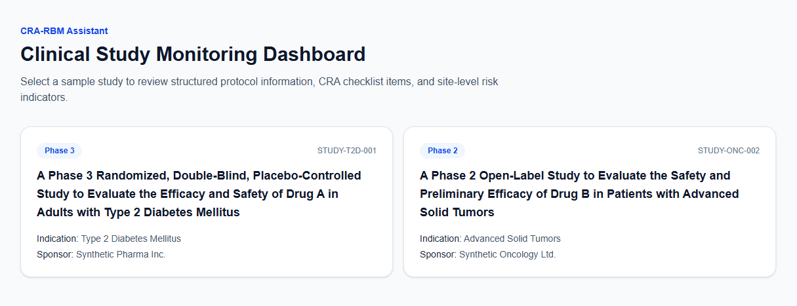

### ClinicalTrials.gov Study Import

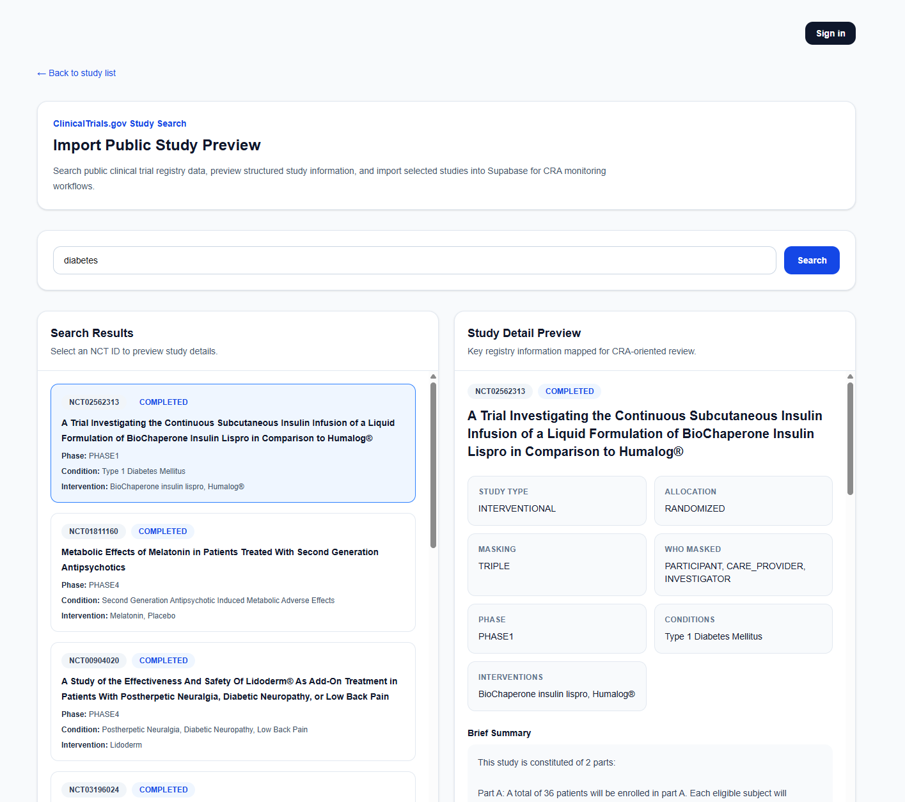

### Login and Auth-gated Import

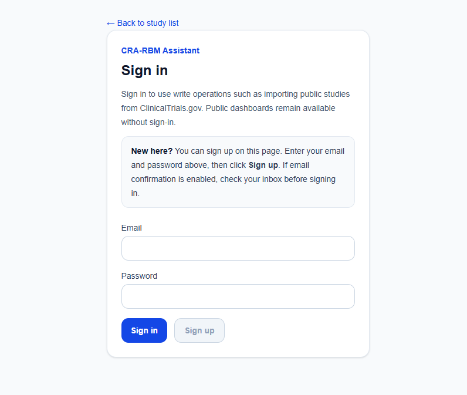

### Study Overview

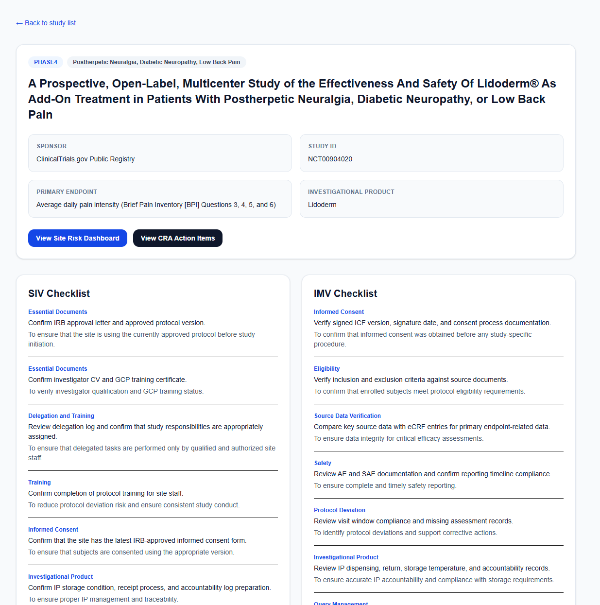

### Site Risk Dashboard

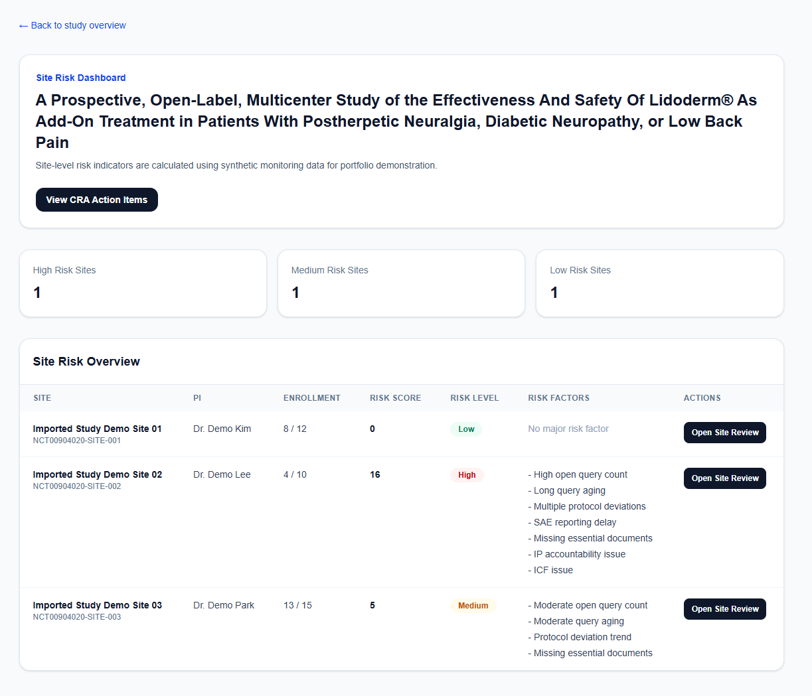

### Site Review Hub

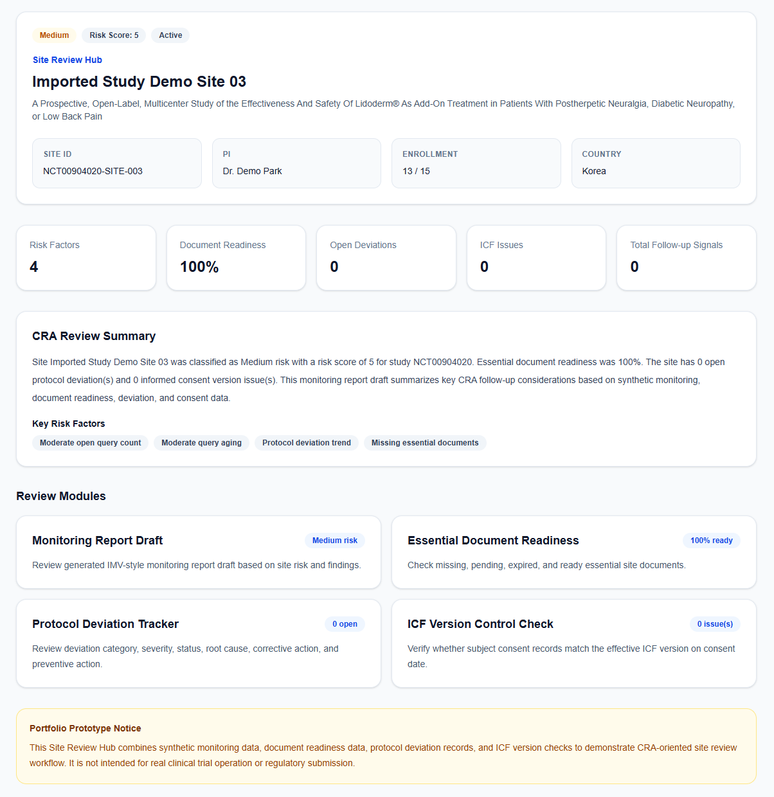

### Enhanced Monitoring Report Draft

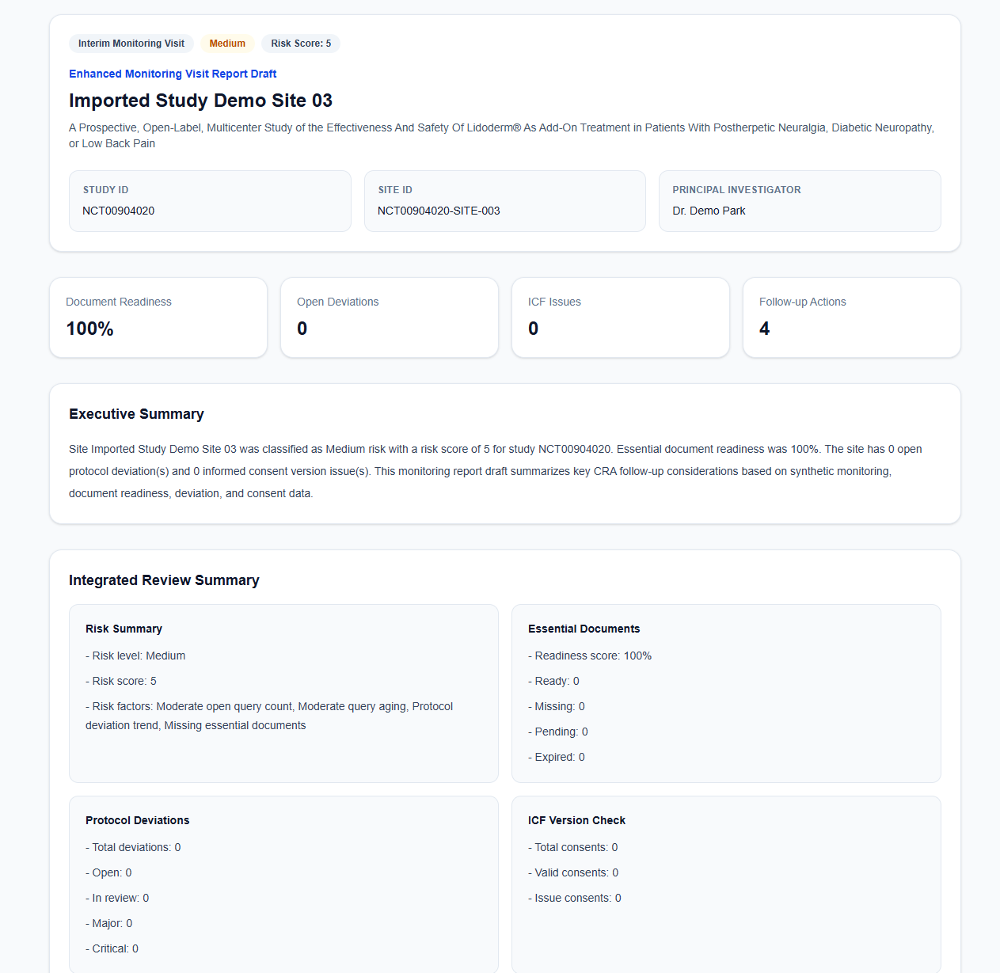

### Essential Document Readiness Tracker

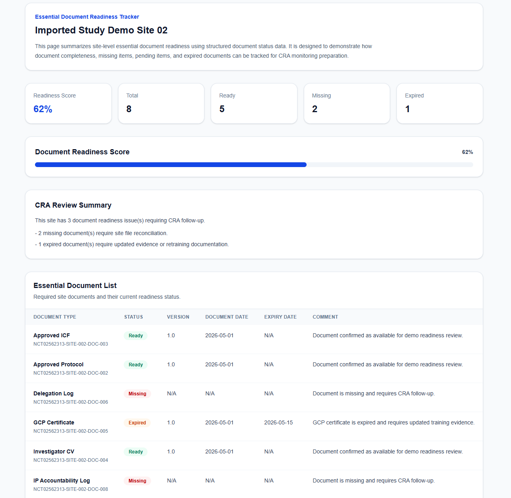

### Protocol Deviation Tracker

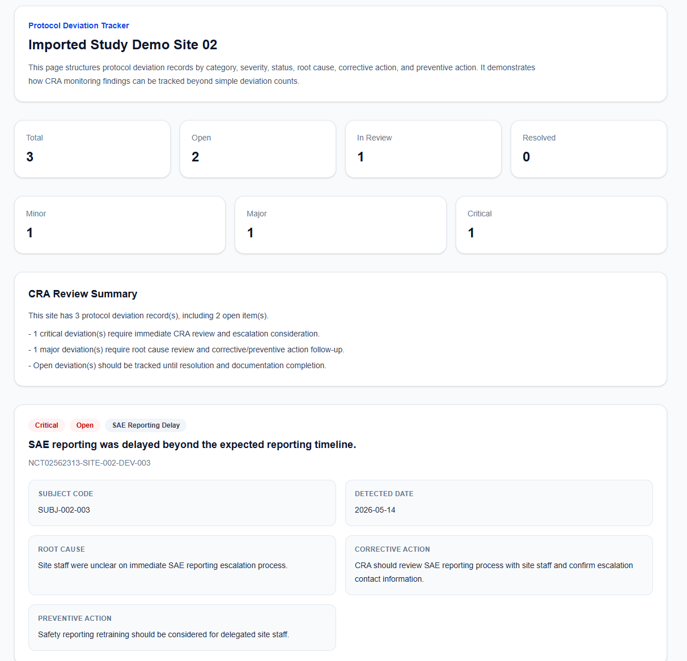

### ICF Version Control Check

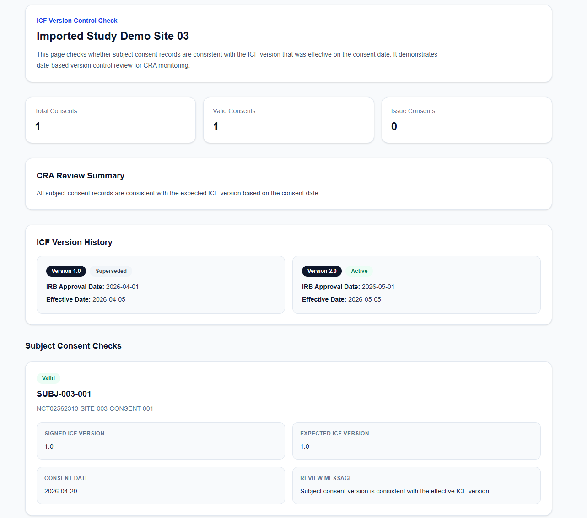

### Trigger-based Audit-like Logs

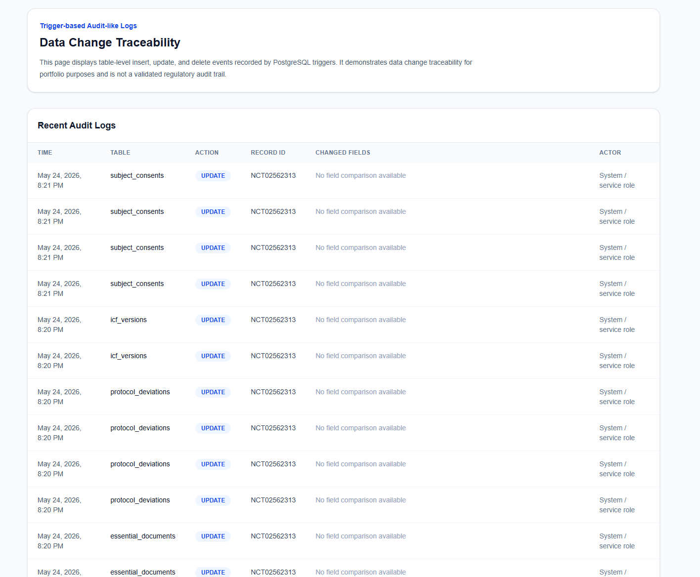

## 16. Supabase Setup

This project uses Supabase PostgreSQL for study, site, monitoring metric, checklist, and audit-like log data.

Main tables:

- studies
- sites
- monitoring_metrics
- checklist_templates
- essential_documents
- protocol_deviations
- icf_versions
- subject_consents
- audit_logs

The initial seed data can be inserted using the backend seed script.
Trigger-based audit-like logs are applied to selected operational tables to record insert, update, and delete events with oldData and newData JSONB snapshots.

```bash
cd backend
python scripts/seed_supabase.py
```

## 17. License

This project is licensed under the MIT License.

This project is a portfolio prototype and is not intended for real clinical trial operation, regulatory submission, or validated clinical system use.

---

> **Korean documentation:** [README_kr.md](README_kr.md)
