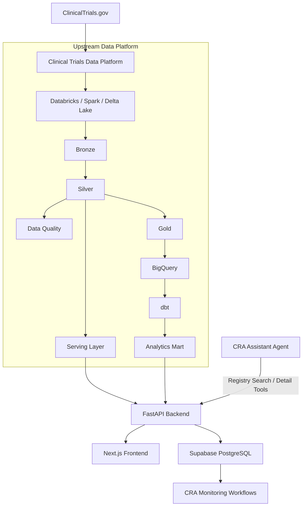

# CRA-RBM Assistant

CRA-RBM Assistant is a clinical trial monitoring support prototype that connects a cloud-based clinical trial data platform with application workflows for study registry search, study import, clinical trial analytics, and scenario-based CRA monitoring review.

The project combines:

- public ClinicalTrials.gov registry data
- Databricks-based serving datasets
- FastAPI application APIs
- Supabase-backed internal study workspaces
- synthetic CRA operational scenarios
- risk-based monitoring dashboards
- audit-like traceability
- an external CRA Assistant Agent that can query registry data through application APIs

> This project is a portfolio prototype. It is not a validated clinical trial system and is not intended for real clinical trial operation, regulatory submission, or medical/regulatory decision-making.

---

## Live Demo

- **Frontend:** https://cra-rbm-assistant.vercel.app
- **Backend API Docs:** https://cra-rbm-assistant.onrender.com/docs

> The backend is hosted on a free tier and may take some time to wake up after inactivity.

---

## What This Project Demonstrates

CRA-RBM Assistant was originally designed to translate CRA monitoring concepts into structured software workflows. It has since been extended to consume a separate clinical trial data engineering pipeline and expose those datasets through both application and AI-agent interfaces.

The project demonstrates how:

- public registry data can be transformed into application-ready serving models
- data platform outputs can be consumed without tightly coupling the frontend to the source system
- imported public study metadata can be separated from synthetic operational monitoring data
- site-level risk indicators can be organized into CRA-oriented review workflows
- data quality and consistency checks can support monitoring preparation
- application APIs can be reused by an external AI agent as tools

---

## System Architecture


```mermaid
flowchart TD
    CTG[ClinicalTrials.gov] --> DPLAT[Clinical Trials Data Platform]

    subgraph DataPlatform[Upstream Data Platform]
        DPLAT --> DBX[Databricks / Spark / Delta Lake]
        DBX --> BRONZE[Bronze]
        BRONZE --> SILVER[Silver]
        SILVER --> QUALITY[Data Quality]
        SILVER --> GOLD[Gold]
        SILVER --> SERVING[Serving Layer]
        GOLD --> BQ[BigQuery]
        BQ --> DBT[dbt]
        DBT --> MART[Analytics Mart]
    end

    SERVING --> FASTAPI[FastAPI Backend]
    MART --> FASTAPI

    FASTAPI --> NEXT[Next.js Frontend]
    FASTAPI --> SUPABASE[Supabase PostgreSQL]

    SUPABASE --> CRA[CRA Monitoring Workflows]

    AGENT[CRA Assistant Agent] -->|Registry Search / Detail Tools| FASTAPI
```

The application does not query the ClinicalTrials.gov API directly during normal registry search and detail workflows.

Instead:

1. ClinicalTrials.gov data is collected and transformed by the upstream data platform.
2. Databricks Serving tables expose application-oriented registry datasets.
3. FastAPI queries those serving tables through Databricks SQL.
4. The frontend consumes stable FastAPI contracts.
5. Imported studies are converted into the internal CRA-RBM study format and stored in Supabase.

This keeps the application decoupled from the raw external registry schema.

---

## Upstream Clinical Trial Data Platform

The registry and analytics features are backed by a separate `clinical-trials-data-platform` project.

The upstream platform includes:

- paginated ClinicalTrials.gov ingestion
- raw JSON archival
- Databricks / Apache Spark / Delta Lake processing
- Bronze, Silver, Gold, Quality, and Serving layers
- normalized study, condition, intervention, outcome, and location entities
- data quality checks
- watermark-based incremental ingestion
- Delta MERGE with hash-based change detection
- Databricks workflow orchestration
- BigQuery export and row-count reconciliation
- dbt staging and analytics mart modeling

At the current project snapshot, the full-load baseline contains approximately **604k public studies**, with nested Silver entities expanded into millions of structured rows.

Detailed ingestion, quality, incremental processing, and warehouse modeling logic belongs to the data-platform repository rather than this application repository.

---

## Data Boundaries

This project deliberately separates three categories of data.

### 1. Public Registry Data

Public study-level metadata derived from ClinicalTrials.gov, including fields such as:

- NCT ID
- study title
- study type
- phase
- overall status
- conditions
- interventions
- outcomes
- eligibility criteria
- masking
- enrollment
- study locations

Registry search and detail responses are served from Databricks-based application serving tables.

The registry dataset is a stored platform snapshot and should not be interpreted as a live ClinicalTrials.gov lookup at response time.

### 2. Internal CRA-RBM Study Workspace Data

A registry study can be imported into Supabase and converted into the application's internal Study model.

The internal workspace contains application-oriented fields used by:

- Study Overview
- Site Review Hub
- Risk Dashboard
- Action Items
- Monitoring Report Draft
- CRA checklist views

Registry metadata and internal operational state are intentionally kept conceptually separate.

### 3. Synthetic Operational Data

Site-level operational data is synthetic and generated only for demonstration.

Synthetic scenarios include:

- essential document readiness issues
- protocol deviations
- ICF version inconsistencies
- delegation and training inconsistencies
- query aging
- SAE reporting delay signals
- site-level risk indicators
- CRA follow-up actions

No real patient data, subject data, real site performance data, sponsor-confidential protocol, or proprietary clinical trial document is used.

---

## Core Application Workflows

### Clinical Trial Registry Search

The application provides registry search backed by Databricks Serving data.

Supported search dimensions include:

- keyword / condition
- NCT ID
- study title
- overall status
- phase
- country

Search results are ordered using registry update metadata so that recently updated records can be surfaced first.

Application-facing serving data is intentionally denormalized for search convenience, including arrays such as:

- conditions
- countries
- intervention names

### Registry Study Detail

Detailed registry responses include:

- official title
- study type
- phase
- status
- enrollment
- study design fields
- masking and who-masked information
- brief summary
- eligibility criteria
- interventions
- outcomes
- locations

The detail endpoint is designed for study inspection and for reuse by the import workflow and external AI tools.

### Study Import

Authenticated users can import a selected registry study into Supabase.

```text
Databricks Serving
    ↓
FastAPI Registry Service
    ↓
Registry → Internal Study Mapping
    ↓
Supabase Study
    ↓
Synthetic Operational Data Generation
    ↓
CRA-RBM Monitoring Workflow
```

The existing frontend import workflow is preserved through a compatibility API layer, while the underlying data source is now the Databricks Serving Layer.

Imported public study metadata and generated synthetic operational data are kept logically distinct.

### Study Overview

Displays structured study information used by the CRA-RBM workflow, including:

- study title
- phase
- indication
- study design
- intervention
- primary / secondary endpoint information
- eligibility criteria
- registry-derived study metadata

### CRA Checklist Views

Provides CRA-oriented SIV and IMV checklist content for review areas such as:

- essential documents
- informed consent
- eligibility
- safety reporting
- investigational product accountability
- source data and eCRF consistency
- query management

Checklist content is prototype logic and does not replace sponsor procedures, protocol requirements, or CRA judgement.

### Site Risk Dashboard

Visualizes synthetic monitoring indicators such as:

- open query count
- query aging
- protocol deviation count
- SAE reporting delay signals
- missing essential documents
- IP accountability issues
- ICF issues
- calculated risk score
- risk level

Enrollment fields may be displayed for context but are not necessarily part of the risk calculation.

### Site Review Hub

The Site Review Hub consolidates multiple review dimensions into a single site-level workspace:

- site risk
- essential document readiness
- protocol deviations
- ICF version consistency
- delegation and training consistency
- monitoring report draft
- CRA follow-up actions

### CRA Follow-up Action Items

Synthetic site findings are converted into follow-up suggestions such as:

- query resolution follow-up
- protocol deviation root-cause review
- safety process follow-up
- essential document reconciliation
- site staff retraining consideration

These are demonstration outputs, not validated operational recommendations.

### Monitoring Report Draft

Generates an IMV-style draft by combining structured synthetic monitoring findings such as:

- site risk summary
- essential document findings
- protocol deviation findings
- ICF consistency findings
- CRA follow-up actions

### Essential Document Readiness

Tracks synthetic document status such as:

- Ready
- Missing
- Pending
- Expired

### Protocol Deviation Tracker

Tracks synthetic protocol deviations by:

- category
- severity
- status
- subject code
- root cause
- corrective action
- preventive action

### ICF Version Control Check

Checks whether synthetic subject-consent records are consistent with the ICF version effective on the consent date.

### Delegation & Training Consistency Check

Checks whether delegated synthetic site staff completed required training before the delegation start date.

Example findings include:

- missing GCP training evidence
- missing protocol training evidence
- GCP training completed after delegation start
- protocol training completed after delegation start

---

## Clinical Trial Analytics

The application includes a clinical trial analytics dashboard backed by a warehouse-oriented data path.

```text
Databricks Gold
    ↓
BigQuery
    ↓
dbt
    ↓
Analytics Mart
    ↓
FastAPI
    ↓
Next.js Dashboard
```

The analytics layer includes:

- overall trial counts
- study-type distribution
- yearly trial trends
- country-level summaries
- condition trends

dbt is used to manage warehouse-side SQL transformations, model dependencies, and data tests.

---

## CRA Assistant Agent Integration

CRA-RBM Assistant also exposes registry APIs to an external CRA Assistant Agent.

The agent currently uses application APIs through tools such as:

- `searchRegistryStudies`
- `getRegistryStudyDetail`

```text
User
    ↓
CRA Assistant Agent
    ↓
Registry Tool
    ↓
FastAPI
    ↓
Databricks Serving Layer
```

The agent does not connect directly to Databricks.

This preserves FastAPI as the application/service boundary and allows the underlying data platform to evolve without changing the agent's tool contract.

Registry factual data is kept separate from synthetic CRA-RBM operational data in the agent instructions.

---

## Audit-like Traceability

Selected Supabase tables use PostgreSQL triggers to record change history.

Tracked operations include:

- insert
- update
- delete
- previous JSONB state
- new JSONB state

This feature demonstrates data-change traceability concepts.

It is intentionally described as **audit-like logging** and is **not** a validated regulatory audit trail.

---

## Authentication

Supabase Auth protects write operations such as study import.

Current behavior:

- public users can browse demo dashboards and CRA review pages
- authenticated users can import registry studies
- study import can create or update Supabase records
- imported studies can trigger deterministic synthetic operational data generation

This is a portfolio-oriented access model rather than a production multi-tenant authorization design.

---

## API Overview

### Registry APIs

| Method | Endpoint                         | Description                                      |
| ------ | -------------------------------- | ------------------------------------------------ |
| GET    | `/api/registry/studies`          | Search studies from the Databricks Serving Layer |
| GET    | `/api/registry/studies/{nct_id}` | Get detailed registry study information          |

### Clinical Trial Import Compatibility APIs

These routes preserve the existing frontend import contract while using the registry service internally.

| Method | Endpoint                                        | Description                                           |
| ------ | ----------------------------------------------- | ----------------------------------------------------- |
| GET    | `/api/external/clinical-trials/search`          | Search public registry studies                        |
| GET    | `/api/external/clinical-trials/{nct_id}`        | Get registry study detail                             |
| POST   | `/api/external/clinical-trials/{nct_id}/import` | Import a study into Supabase; authentication required |

### Analytics APIs

| Method | Endpoint                    | Description                                    |
| ------ | --------------------------- | ---------------------------------------------- |
| GET    | `/api/analytics/overview`   | Trial overview metrics from the analytics mart |
| GET    | `/api/analytics/yearly`     | Yearly trial trend                             |
| GET    | `/api/analytics/countries`  | Country-level summary                          |
| GET    | `/api/analytics/conditions` | Condition-level trend                          |

### Study APIs

| Method | Endpoint                               | Description                           |
| ------ | -------------------------------------- | ------------------------------------- |
| GET    | `/api/studies`                         | Get internal studies                  |
| GET    | `/api/studies/{study_id}`              | Get internal study detail             |
| GET    | `/api/studies/{study_id}/sites`        | Get sites for a study                 |
| GET    | `/api/studies/{study_id}/risk-sites`   | Get sites with calculated risk scores |
| GET    | `/api/studies/{study_id}/action-items` | Get CRA follow-up action items        |

### Site Review APIs

| Method | Endpoint                                                            | Description                       |
| ------ | ------------------------------------------------------------------- | --------------------------------- |
| GET    | `/api/studies/{study_id}/sites/{site_id}/review-summary`            | Integrated site review summary    |
| GET    | `/api/studies/{study_id}/sites/{site_id}/monitoring-report-draft`   | Monitoring report draft           |
| GET    | `/api/studies/{study_id}/sites/{site_id}/essential-documents`       | Essential document readiness      |
| GET    | `/api/studies/{study_id}/sites/{site_id}/protocol-deviations`       | Protocol deviation summary        |
| GET    | `/api/studies/{study_id}/sites/{site_id}/icf-version-check`         | ICF version consistency           |
| GET    | `/api/studies/{study_id}/sites/{site_id}/delegation-training-check` | Delegation / training consistency |

### Other APIs

| Method | Endpoint                      | Description               |
| ------ | ----------------------------- | ------------------------- |
| GET    | `/api/checklists/siv`         | SIV checklist             |
| GET    | `/api/checklists/imv`         | IMV checklist             |
| GET    | `/api/risk/sites`             | Site risk results         |
| GET    | `/api/audit-logs`             | Audit-like change logs    |
| GET    | `/api/alerts/high-risk-sites` | High-risk site alert list |

---

## Tech Stack

### Frontend

- Next.js
- TypeScript
- React Query
- Recharts
- Tailwind CSS / shadcn-ui
- Vercel

### Backend

- FastAPI
- Python
- Databricks SQL Connector
- Google Cloud BigQuery client
- Render

### Application Database / Auth

- Supabase PostgreSQL
- Supabase Auth

### Upstream Data Platform

- Databricks
- Apache Spark
- Delta Lake
- Databricks Workflows
- Databricks SQL
- BigQuery
- dbt

### Public Data Source

- ClinicalTrials.gov public registry

### External AI Integration

- CRA Assistant Agent
- Cloudflare Workers / Think
- Tool-based registry search and study-detail access

---

## Repository Structure

```text
CRA-RBM Assistant/
├─ backend/
│  ├─ app/
│  │  ├─ api/
│  │  ├─ repositories/
│  │  ├─ schemas/
│  │  ├─ services/
│  │  └─ utils/
│  ├─ scripts/
│  └─ requirements.txt
│
├─ frontend/
│  └─ src/
│     ├─ app/
│     ├─ components/
│     ├─ lib/
│     └─ types/
│
└─ docs/
```

The upstream clinical trial data platform and CRA Assistant Agent are separate projects and are integrated through API boundaries rather than embedded directly in this repository.

---

## Local Development

### Backend

```bash
cd backend
python -m venv .venv

# Windows
.venv\Scripts\activate

pip install -r requirements.txt
uvicorn app.main:app --env-file .env --reload
```

Backend API documentation:

```text
http://127.0.0.1:8000/docs
```

### Frontend

```bash
cd frontend
npm install
npm run dev
```

---

## Environment Variables

### Backend

Example `backend/.env`:

```env
# Supabase
SUPABASE_URL=
SUPABASE_KEY=
DATA_SOURCE=supabase

# Databricks Serving
DATABRICKS_SERVER_HOSTNAME=
DATABRICKS_HTTP_PATH=
DATABRICKS_TOKEN=
DATABRICKS_CATALOG=workspace
DATABRICKS_SCHEMA=clinical_trials

# BigQuery analytics
GCP_PROJECT_ID=
BQ_DATASET_ID=clinical_trials
GCP_SERVICE_ACCOUNT_FILE=

# Production deployments may use:
# GCP_SERVICE_ACCOUNT_JSON=
```

Do not commit service-account JSON, Databricks tokens, or other credentials.

### Frontend

Example `frontend/.env.local`:

```env
NEXT_PUBLIC_API_BASE_URL=http://localhost:8000
NEXT_PUBLIC_SUPABASE_URL=
NEXT_PUBLIC_SUPABASE_ANON_KEY=
```

---

## Screenshots

Recommended screenshots for the repository and portfolio:

- Study Import / Registry Search
- Registry Study Preview
- Clinical Trial Analytics Dashboard
- Study Overview
- Site Risk Dashboard
- Site Review Hub
- Monitoring Report Draft
- Essential Document Readiness
- Protocol Deviation Tracker
- ICF Version Control Check
- Delegation & Training Check
- Audit-like Logs

Existing project screenshots can be stored under `docs/images/`.

---

## Documentation

Additional project documentation:

- [Data Dictionary](docs/data-dictionary.md)
- [Risk Scoring Logic](docs/risk-scoring-logic.md)
- [Scenario-based Synthetic Dataset](docs/scenario-dataset.md)
- [Portfolio Interpretation](docs/portfolio-interpretation.md)
- [Korean README](README_kr.md)

---

## Limitations

This project is intentionally a prototype.

Current limitations include:

- no real patient or subject data
- no sponsor-confidential protocol data
- synthetic site-level operational scenarios
- simplified risk scoring
- predefined checklist / workflow logic
- no validated electronic signature
- no formal computerized system validation
- no 21 CFR Part 11 compliance claim
- audit-like logs are not a validated audit trail
- registry data is a stored platform snapshot rather than a live source check
- imported registry metadata does not contain all protocol-level operational details
- synthetic CRA recommendations do not replace CRA judgement
- current demo authorization is not a production-grade multi-tenant access-control model

---

## Scope and Design Principles

The project follows several explicit boundaries:

1. **Registry facts and synthetic operations are separated.**
2. **The frontend depends on application APIs, not directly on Databricks.**
3. **The external Agent depends on FastAPI tool contracts, not directly on the data warehouse.**
4. **Unknown protocol-level operational details are not fabricated from registry data.**
5. **Audit-like functionality is not represented as a validated regulatory audit trail.**
6. **The data platform, application, and agent are separate components connected through explicit interfaces.**

The overall portfolio narrative is:

```text
Public Data
    ↓
Data Engineering
    ↓
Application Serving
    ↓
CRA Workflow
    ↓
AI Tool Integration
```

---

## License

This project is licensed under the MIT License.

This repository is intended for portfolio and educational use.
