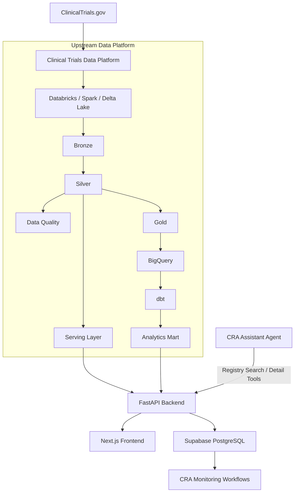

# CRA-RBM Assistant

CRA-RBM Assistant는 클라우드 기반 임상시험 데이터 플랫폼과 애플리케이션 워크플로를 연결하는 임상시험 모니터링 지원 프로토타입입니다. 연구 등록부 검색, 연구 import, 임상시험 분석, 시나리오 기반 CRA 모니터링 검토를 지원합니다.

이 프로젝트는 다음을 결합합니다.

- ClinicalTrials.gov 공개 등록부 데이터
- Databricks 기반 serving 데이터셋
- FastAPI 애플리케이션 API
- Supabase 기반 내부 연구 워크스페이스
- 합성(synthetic) CRA 운영 시나리오
- 위험 기반 모니터링(RBM) 대시보드
- 감사(audit) 유사 추적성
- 애플리케이션 API를 통해 등록부 데이터를 조회할 수 있는 외부 CRA Assistant Agent

> 본 프로젝트는 포트폴리오 프로토타입입니다. 검증된 임상시험 시스템이 아니며, 실제 임상시험 운영, 규제 제출, 의료·규제 의사결정 용도가 아닙니다.

---

## Live Demo

- **Frontend:** https://cra-rbm-assistant.vercel.app
- **Backend API Docs:** https://cra-rbm-assistant.onrender.com/docs

> 백엔드는 무료 플랜에 호스팅되어 있어, 유휴 상태 후 첫 요청 시 깨어나는 데 시간이 걸릴 수 있습니다.

---

## What This Project Demonstrates

CRA-RBM Assistant는 원래 CRA 모니터링 개념을 구조화된 소프트웨어 워크플로로 옮기기 위해 설계되었습니다. 이후에는 별도의 임상시험 데이터 엔지니어링 파이프라인을 소비하고, 그 데이터셋을 애플리케이션과 AI 에이전트 인터페이스를 통해 노출하도록 확장되었습니다.

이 프로젝트가 보여 주는 내용:

- 공개 등록부 데이터를 애플리케이션용 serving 모델로 변환할 수 있음
- 프론트엔드를 원천 시스템에 강하게 결합하지 않고도 데이터 플랫폼 출력을 소비할 수 있음
- import된 공개 연구 메타데이터와 합성 운영 모니터링 데이터를 분리할 수 있음
- 사이트 수준 위험 지표를 CRA 지향 검토 워크플로로 조직할 수 있음
- 데이터 품질·일관성 점검이 모니터링 준비를 지원할 수 있음
- 애플리케이션 API를 외부 AI 에이전트가 도구(tool)로 재사용할 수 있음

---

## System Architecture



일반 등록부 검색·상세 조회 워크플로에서 애플리케이션은 ClinicalTrials.gov API를 직접 호출하지 않습니다.

대신 흐름은 다음과 같습니다.

1. ClinicalTrials.gov 데이터를 상위 데이터 플랫폼이 수집·변환합니다.
2. Databricks Serving 테이블이 애플리케이션용 등록부 데이터셋을 노출합니다.
3. FastAPI가 Databricks SQL을 통해 해당 serving 테이블을 조회합니다.
4. 프론트엔드는 안정적인 FastAPI 계약을 소비합니다.
5. import된 연구는 내부 CRA-RBM study 형식으로 변환되어 Supabase에 저장됩니다.

이렇게 하면 애플리케이션이 원천 외부 등록부 스키마로부터 분리됩니다.

---

## Upstream Clinical Trial Data Platform

등록부·분석 기능은 별도의 `clinical-trials-data-platform` 프로젝트를 기반으로 합니다.

상위 플랫폼에 포함된 내용:

- ClinicalTrials.gov 페이지네이션 기반 ingestion
- raw JSON 아카이브
- Databricks / Apache Spark / Delta Lake 처리
- Bronze, Silver, Gold, Quality, Serving 레이어
- study, condition, intervention, outcome, location 등 정규화 엔티티
- 데이터 품질 점검
- watermark 기반 증분 ingestion
- 해시 기반 변경 탐지를 포함한 Delta MERGE
- Databricks workflow 오케스트레이션
- BigQuery export 및 row-count 정합성 점검
- dbt staging 및 analytics mart 모델링

현재 스냅샷 기준으로 full-load 베이스라인은 약 **60.4만 건의 공개 연구**를 포함하며, nested Silver 엔티티는 수백만 건의 구조화 행으로 확장됩니다.

ingestion, 품질, 증분 처리, warehouse 모델링의 상세 로직은 이 애플리케이션 저장소가 아니라 데이터 플랫폼 저장소에 속합니다.

---

## Data Boundaries

이 프로젝트는 세 가지 데이터 범주를 의도적으로 분리합니다.

### 1. Public Registry Data

ClinicalTrials.gov에서 파생된 공개 연구 수준 메타데이터입니다. 예:

- NCT ID
- study title
- study type
- phase
- overall status
- conditions
- interventions
- outcomes
- eligibility criteria
- masking
- enrollment
- study locations

등록부 검색·상세 응답은 Databricks 기반 애플리케이션 serving 테이블에서 제공됩니다.

등록부 데이터셋은 저장된 플랫폼 스냅샷이며, 응답 시점의 실시간 ClinicalTrials.gov 조회로 해석하면 안 됩니다.

### 2. Internal CRA-RBM Study Workspace Data

등록부 연구를 Supabase로 import하여 애플리케이션의 내부 Study 모델로 변환할 수 있습니다.

내부 워크스페이스는 다음 기능에서 사용하는 애플리케이션 지향 필드를 포함합니다.

- Study Overview
- Site Review Hub
- Risk Dashboard
- Action Items
- Monitoring Report Draft
- CRA checklist views

등록부 메타데이터와 내부 운영 상태는 개념적으로 분리되어 있습니다.

### 3. Synthetic Operational Data

사이트 수준 운영 데이터는 시연용으로만 생성된 합성 데이터입니다.

합성 시나리오 예:

- 필수 문서 준비 이슈
- 프로토콜 일탈
- ICF 버전 불일치
- 위임·교육 불일치
- query aging
- SAE 보고 지연 신호
- 사이트 수준 위험 지표
- CRA 후속 조치

실제 환자·피험자 데이터, 실제 사이트 성과 데이터, 스폰서 기밀 프로토콜, 독점 임상시험 문서는 사용하지 않습니다.

---

## Core Application Workflows

### Clinical Trial Registry Search

Databricks Serving 데이터를 기반으로 등록부 검색을 제공합니다.

지원하는 검색 차원:

- keyword / condition
- NCT ID
- study title
- overall status
- phase
- country

검색 결과는 등록부 업데이트 메타데이터로 정렬되어, 최근 갱신된 레코드가 먼저 노출될 수 있습니다.

애플리케이션용 serving 데이터는 검색 편의를 위해 의도적으로 denormalize되어 있으며, 다음 배열을 포함합니다.

- conditions
- countries
- intervention names

### Registry Study Detail

상세 등록부 응답에 포함되는 항목:

- official title
- study type
- phase
- status
- enrollment
- study design fields
- masking 및 who-masked 정보
- brief summary
- eligibility criteria
- interventions
- outcomes
- locations

상세 엔드포인트는 연구 조회, import 워크플로, 외부 AI 도구 재사용을 위해 설계되었습니다.

### Study Import

인증된 사용자는 선택한 등록부 연구를 Supabase로 import할 수 있습니다.

```text
Databricks Serving
    ↓
FastAPI Registry Service
    ↓
Registry → Internal Study Mapping
    ↓
Supabase Study
    ↓
Synthetic Operational Data Generation
    ↓
CRA-RBM Monitoring Workflow
```

기존 프론트엔드 import 워크플로는 호환 API 계층으로 유지되며, 내부 데이터 소스는 이제 Databricks Serving Layer입니다.

import된 공개 연구 메타데이터와 생성된 합성 운영 데이터는 논리적으로 구분됩니다.

### Study Overview

CRA-RBM 워크플로에서 사용하는 구조화된 연구 정보를 표시합니다.

- study title
- phase
- indication
- study design
- intervention
- primary / secondary endpoint 정보
- eligibility criteria
- 등록부에서 파생된 연구 메타데이터

### CRA Checklist Views

다음 검토 영역에 대한 CRA 지향 SIV·IMV 체크리스트 콘텐츠를 제공합니다.

- essential documents
- informed consent
- eligibility
- safety reporting
- investigational product accountability
- source data 및 eCRF 일치성
- query management

체크리스트 콘텐츠는 프로토타입 로직이며, 스폰서 절차·프로토콜 요건·CRA 판단을 대체하지 않습니다.

### Site Risk Dashboard

다음과 같은 합성 모니터링 지표를 시각화합니다.

- open query count
- query aging
- protocol deviation count
- SAE reporting delay signals
- missing essential documents
- IP accountability issues
- ICF issues
- 계산된 risk score
- risk level

Enrollment 필드는 맥락 표시용으로 쓰일 수 있으나, 위험 점수 계산에 반드시 포함되는 것은 아닙니다.

### Site Review Hub

Site Review Hub는 여러 검토 차원을 하나의 사이트 수준 워크스페이스로 통합합니다.

- site risk
- essential document readiness
- protocol deviations
- ICF version consistency
- delegation and training consistency
- monitoring report draft
- CRA follow-up actions

### CRA Follow-up Action Items

합성 사이트 소견을 다음과 같은 후속 제안으로 변환합니다.

- query resolution follow-up
- protocol deviation root-cause review
- safety process follow-up
- essential document reconciliation
- site staff retraining consideration

시연용 출력이며, 검증된 운영 권고가 아닙니다.

### Monitoring Report Draft

다음과 같은 구조화된 합성 모니터링 소견을 결합해 IMV 스타일 초안을 생성합니다.

- site risk summary
- essential document findings
- protocol deviation findings
- ICF consistency findings
- CRA follow-up actions

### Essential Document Readiness

합성 문서 상태를 추적합니다.

- Ready
- Missing
- Pending
- Expired

### Protocol Deviation Tracker

합성 프로토콜 일탈을 다음 기준으로 추적합니다.

- category
- severity
- status
- subject code
- root cause
- corrective action
- preventive action

### ICF Version Control Check

합성 피험자 동의 기록이 동의일 기준 유효한 ICF 버전과 일치하는지 확인합니다.

### Delegation & Training Consistency Check

위임된 합성 사이트 스태프가 위임 시작일 이전에 필수 교육을 완료했는지 확인합니다.

예시 소견:

- missing GCP training evidence
- missing protocol training evidence
- GCP training completed after delegation start
- protocol training completed after delegation start

---

## Clinical Trial Analytics

애플리케이션은 warehouse 지향 데이터 경로를 기반으로 임상시험 분석 대시보드를 포함합니다.

```text
Databricks Gold
    ↓
BigQuery
    ↓
dbt
    ↓
Analytics Mart
    ↓
FastAPI
    ↓
Next.js Dashboard
```

분석 레이어에 포함되는 내용:

- overall trial counts
- study-type distribution
- yearly trial trends
- country-level summaries
- condition trends

dbt는 warehouse 측 SQL 변환, 모델 의존성, 데이터 테스트를 관리하는 데 사용됩니다.

---

## CRA Assistant Agent Integration

CRA-RBM Assistant는 등록부 API를 외부 CRA Assistant Agent에도 노출합니다.

에이전트가 현재 사용하는 애플리케이션 API 도구 예:

- `searchRegistryStudies`
- `getRegistryStudyDetail`

```text
User
    ↓
CRA Assistant Agent
    ↓
Registry Tool
    ↓
FastAPI
    ↓
Databricks Serving Layer
```

에이전트는 Databricks에 직접 연결하지 않습니다.

FastAPI를 애플리케이션/서비스 경계로 유지하므로, 하위 데이터 플랫폼이 바뀌어도 에이전트의 tool 계약을 바꿀 필요가 없습니다.

에이전트 지침에서도 등록부 사실 데이터와 합성 CRA-RBM 운영 데이터는 분리되어 있습니다.

---

## Audit-like Traceability

선택된 Supabase 테이블은 PostgreSQL 트리거로 변경 이력을 기록합니다.

추적 대상:

- insert
- update
- delete
- previous JSONB state
- new JSONB state

이 기능은 데이터 변경 추적성 개념을 시연합니다.

의도적으로 **audit-like logging**으로 설명하며, 검증된 규제용 audit trail이 **아닙니다**.

---

## Authentication

Supabase Auth는 study import와 같은 쓰기 작업을 보호합니다.

현재 동작:

- 공개 사용자는 데모 대시보드와 CRA 검토 페이지를 조회할 수 있음
- 인증된 사용자는 등록부 연구를 import할 수 있음
- study import는 Supabase 레코드를 생성하거나 갱신할 수 있음
- import된 연구는 결정적 합성 운영 데이터 생성을 트리거할 수 있음

이는 포트폴리오 지향 접근 모델이며, 프로덕션 다중 테넌트 인가 설계가 아닙니다.

---

## API Overview

### Registry APIs

| Method | Endpoint                         | Description                            |
| ------ | -------------------------------- | -------------------------------------- |
| GET    | `/api/registry/studies`          | Databricks Serving Layer에서 연구 검색 |
| GET    | `/api/registry/studies/{nct_id}` | 등록부 연구 상세 정보 조회             |

### Clinical Trial Import Compatibility APIs

기존 프론트엔드 import 계약을 유지하면서, 내부적으로는 registry service를 사용합니다.

| Method | Endpoint                                        | Description                       |
| ------ | ----------------------------------------------- | --------------------------------- |
| GET    | `/api/external/clinical-trials/search`          | 공개 등록부 연구 검색             |
| GET    | `/api/external/clinical-trials/{nct_id}`        | 등록부 연구 상세 조회             |
| POST   | `/api/external/clinical-trials/{nct_id}/import` | Supabase로 연구 import; 인증 필요 |

### Analytics APIs

| Method | Endpoint                    | Description                             |
| ------ | --------------------------- | --------------------------------------- |
| GET    | `/api/analytics/overview`   | analytics mart 기반 trial overview 지표 |
| GET    | `/api/analytics/yearly`     | 연도별 trial 추세                       |
| GET    | `/api/analytics/countries`  | 국가별 요약                             |
| GET    | `/api/analytics/conditions` | 질환(condition)별 추세                  |

### Study APIs

| Method | Endpoint                               | Description                    |
| ------ | -------------------------------------- | ------------------------------ |
| GET    | `/api/studies`                         | 내부 연구 목록                 |
| GET    | `/api/studies/{study_id}`              | 내부 연구 상세                 |
| GET    | `/api/studies/{study_id}/sites`        | 연구별 사이트 목록             |
| GET    | `/api/studies/{study_id}/risk-sites`   | 위험 점수가 계산된 사이트 목록 |
| GET    | `/api/studies/{study_id}/action-items` | CRA 후속 조치 항목             |

### Site Review APIs

| Method | Endpoint                                                            | Description           |
| ------ | ------------------------------------------------------------------- | --------------------- |
| GET    | `/api/studies/{study_id}/sites/{site_id}/review-summary`            | 통합 사이트 검토 요약 |
| GET    | `/api/studies/{study_id}/sites/{site_id}/monitoring-report-draft`   | 모니터링 보고서 초안  |
| GET    | `/api/studies/{study_id}/sites/{site_id}/essential-documents`       | 필수 문서 준비 상태   |
| GET    | `/api/studies/{study_id}/sites/{site_id}/protocol-deviations`       | 프로토콜 일탈 요약    |
| GET    | `/api/studies/{study_id}/sites/{site_id}/icf-version-check`         | ICF 버전 일치성       |
| GET    | `/api/studies/{study_id}/sites/{site_id}/delegation-training-check` | 위임 / 교육 일치성    |

### Other APIs

| Method | Endpoint                      | Description             |
| ------ | ----------------------------- | ----------------------- |
| GET    | `/api/checklists/siv`         | SIV 체크리스트          |
| GET    | `/api/checklists/imv`         | IMV 체크리스트          |
| GET    | `/api/risk/sites`             | 사이트 위험 결과        |
| GET    | `/api/audit-logs`             | 감사 유사 변경 로그     |
| GET    | `/api/alerts/high-risk-sites` | 고위험 사이트 알림 목록 |

---

## Tech Stack

### Frontend

- Next.js
- TypeScript
- React Query
- Recharts
- Tailwind CSS / shadcn-ui
- Vercel

### Backend

- FastAPI
- Python
- Databricks SQL Connector
- Google Cloud BigQuery client
- Render

### Application Database / Auth

- Supabase PostgreSQL
- Supabase Auth

### Upstream Data Platform

- Databricks
- Apache Spark
- Delta Lake
- Databricks Workflows
- Databricks SQL
- BigQuery
- dbt

### Public Data Source

- ClinicalTrials.gov public registry

### External AI Integration

- CRA Assistant Agent
- Cloudflare Workers / Think
- Tool-based registry search and study-detail access

---

## Repository Structure

```text
CRA-RBM Assistant/
├─ backend/
│  ├─ app/
│  │  ├─ api/
│  │  ├─ repositories/
│  │  ├─ schemas/
│  │  ├─ services/
│  │  └─ utils/
│  ├─ scripts/
│  └─ requirements.txt
│
├─ frontend/
│  └─ src/
│     ├─ app/
│     ├─ components/
│     ├─ lib/
│     └─ types/
│
└─ docs/
```

상위 임상시험 데이터 플랫폼과 CRA Assistant Agent는 별도 프로젝트이며, 이 저장소에 직접 임베드되지 않고 API 경계를 통해 통합됩니다.

---

## Local Development

### Backend

```bash
cd backend
python -m venv .venv

# Windows
.venv\Scripts\activate

pip install -r requirements.txt
uvicorn app.main:app --env-file .env --reload
```

Backend API documentation:

```text
http://127.0.0.1:8000/docs
```

### Frontend

```bash
cd frontend
npm install
npm run dev
```

---

## Environment Variables

### Backend

Example `backend/.env`:

```env
# Supabase
SUPABASE_URL=
SUPABASE_KEY=
DATA_SOURCE=supabase

# Databricks Serving
DATABRICKS_SERVER_HOSTNAME=
DATABRICKS_HTTP_PATH=
DATABRICKS_TOKEN=
DATABRICKS_CATALOG=workspace
DATABRICKS_SCHEMA=clinical_trials

# BigQuery analytics
GCP_PROJECT_ID=
BQ_DATASET_ID=clinical_trials
GCP_SERVICE_ACCOUNT_FILE=

# Production deployments may use:
# GCP_SERVICE_ACCOUNT_JSON=
```

서비스 계정 JSON, Databricks 토큰 등 자격 증명은 커밋하지 마세요.

### Frontend

Example `frontend/.env.local`:

```env
NEXT_PUBLIC_API_BASE_URL=http://localhost:8000
NEXT_PUBLIC_SUPABASE_URL=
NEXT_PUBLIC_SUPABASE_ANON_KEY=
```

---

## Screenshots

저장소·포트폴리오용으로 권장하는 스크린샷:

- Study Import / Registry Search
- Registry Study Preview
- Clinical Trial Analytics Dashboard
- Study Overview
- Site Risk Dashboard
- Site Review Hub
- Monitoring Report Draft
- Essential Document Readiness
- Protocol Deviation Tracker
- ICF Version Control Check
- Delegation & Training Check
- Audit-like Logs

기존 프로젝트 스크린샷은 `docs/images/`에 저장할 수 있습니다.

---

## Documentation

추가 프로젝트 문서:

- [Data Dictionary](docs/data-dictionary.md)
- [Risk Scoring Logic](docs/risk-scoring-logic.md)
- [Scenario-based Synthetic Dataset](docs/scenario-dataset.md)
- [Portfolio Interpretation](docs/portfolio-interpretation.md)
- [English README](README.md)

---

## Limitations

이 프로젝트는 의도적으로 프로토타입입니다.

현재 한계:

- 실제 환자·피험자 데이터 없음
- 스폰서 기밀 프로토콜 데이터 없음
- 합성 사이트 수준 운영 시나리오
- 단순화된 위험 점수 산정
- 사전 정의된 체크리스트 / 워크플로 로직
- 검증된 전자서명 없음
- 공식적인 전산 시스템 밸리데이션 없음
- 21 CFR Part 11 준수 주장 없음
- audit-like 로그는 검증된 audit trail이 아님
- 등록부 데이터는 실시간 원천 조회가 아니라 저장된 플랫폼 스냅샷
- import된 등록부 메타데이터에 모든 프로토콜 수준 운영 상세가 포함되지 않음
- 합성 CRA 권고는 CRA 판단을 대체하지 않음
- 현재 데모 인가는 프로덕션급 다중 테넌트 접근 제어 모델이 아님

---

## Scope and Design Principles

이 프로젝트는 다음 경계를 명시적으로 따릅니다.

1. **등록부 사실과 합성 운영 데이터를 분리한다.**
2. **프론트엔드는 Databricks가 아니라 애플리케이션 API에 의존한다.**
3. **외부 Agent는 데이터 웨어하우스가 아니라 FastAPI tool 계약에 의존한다.**
4. **알 수 없는 프로토콜 수준 운영 상세를 등록부 데이터로부터 만들어내지 않는다.**
5. **audit-like 기능을 검증된 규제용 audit trail로 표현하지 않는다.**
6. **데이터 플랫폼, 애플리케이션, 에이전트는 명시적 인터페이스로 연결된 별도 구성 요소다.**

전체 포트폴리오 서사:

```text
Public Data
    ↓
Data Engineering
    ↓
Application Serving
    ↓
CRA Workflow
    ↓
AI Tool Integration
```

---

## License

이 프로젝트는 MIT License를 따릅니다.

이 저장소는 포트폴리오 및 교육 목적입니다.

---

> **영문 원본:** [README.md](README.md)
